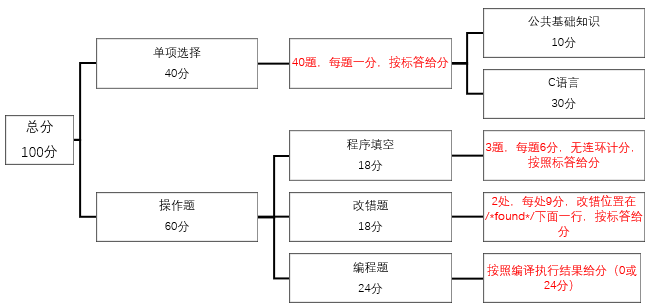

# 全国计算机二级考试c语言复习总结
    20190325 罗心悦
## 注意事项：
- 1.	考试方式和时长：上机考试  120分钟
- 2.	试卷构成①：

- 3.	开发环境：Visual C ++ 6.0 集成开发环境
## 考点整理
### 一、Ｃ语言程序的结构 
- １． 程序的构成， main函数和其他函数。 
- ２． 头文件，数据说明，函数的开始和结束标志以及程序中的注释。 
- ３． 源程序的书写格式。 
- ４． Ｃ语言的风格。
### 二、数据类型及其运算 
- １． Ｃ的数据类型（基本类型，构造类型，指针类型，无值类型）及其定义方法。 
- ２． Ｃ运算符的种类、运算优先级和结合性。
    > 求模运算（求余数运算）：% 
- ３． 不同类型数据间的转换与运算。 
- ４． Ｃ表达式类型（赋值表达式，算术表达式，关系表达式，逻辑表达式，条件表达式，逗号表 达式）和求值规则。 　 
### 三、基本语句 
- １． 表达式语句，空语句，复合语句。 
- ２． 输入输出函数的调用，正确输入数据并正确设计输出格式。
### 四、选择结构程序设计
- １． 用if语句实现选择结构。 
- ２． 用switch语句实现多分支选择结构。
    > Switch（i）;
    >{case i : *****;
    >  default:*****;} 
- ３． 选择结构的嵌套。 
### 五、循环结构程序设计 
- １．for循环结构。 
- ２．while和do-while循环结构。 
    > do…while 是先执行一次循环体，然后再判别表达式

    > do
    >{
    >    语句;
    >}
    >while (表达式);
- ３． continue语句和break语句。
    >continue 语句只结束本次循环，而不是终止整个循环。
    >break 语句则是结束整个循环过程，不再判断执行循环的条件是否成立。
    >而且，continue 只能在循环语句中使用，即只能在 for、while 和 do…while 中使用，除此之外 continue 不能在任何语句中使用。
continue 不能在 switch 中使用，除非 switch 在循环体中。此时 continue 表示的也是结束循环体的本次循环，跟 switch 也没有关系。
- ４． 循环的嵌套。 
### 六、数组的定义和引用 
- １． 一维数组和二维数组的定义、初始化和数组元素的引用。 
    >  二维数组初始化过程中，矩阵形式和定义的行列数有关
- ２． 字符串与字符数组。 
    > C语言字符和字符串都是char[ ] 
### 七、函数 
- １． 库函数的正确调用。 
    > Eg: long ret;     ret=f(n);   //调用函数f（n），并将返回值存入ret
### ２． 函数的定义方法。 
    >Eg： long f（int n）；//函数原型声明（在mian函数之前
    >       Long f（int n）{……}  //函数定义
### ３． 函数的类型和返回值。 
- ４． 形式参数与实际参数，参数值的传递。
    >函数调用时需注意的东西。函数定义中函数首部中的参数叫形参，调用函数时使用的参数叫实参。C函数调用采用“值传递”，比如有函数:
    >int max(int x,int y)
    {
        if(x>y)
        return x;
        return y;
    }
    在调用该函数时，有max（a，b）；则该调用只把a（实参）的值赋给x（形参），把b（实参）的值赋给y（形参）。函数中对x,y的任何动作不改变a,b的值。值得注意的是如果用指针作参数，虽然符合上面原则，但对形参指向的数据的更改会影响实参指向数据的值。
- ５． 函数的正确调用，嵌套调用，递归调用。 
- ６． 局部变量和全局变量。 
- ７． 变量的存储类别（自动，静态，寄存器，外部），变量的作用域和生存期。③ 
    >数据类型：浮点型，整型，字符型等都是一个数据类型；
数据存储类型：数据在内存中的存储方式； 
注意：数据类型和数据存储类型都是针对于声明或定义的函数和变量而言的；
动态存储类型：变量或函数，在被使用时临时分配内存单元，在函数结束后所占用的内存单元将会被释放，例如局部变量；因此，动态存储的变量每次被调用时所占的内存单元的地址可能会发生改变；
静态存储类型：变量或函数，在程序运行期间编译器统一分配内存单元，直到程序结束分配的内存才被释放；例如：全局变量；
1. 自动变量—auto 
定义：函数中，包括复合语句内和形式参数在内的变量中，不被static限制的变量； 
性质：动态存储类型，系统调用函数时临时分配内存单元；函数执行结束就占用的内存释放；
2.静态局部变量—static 
定义：函数内被静态static限制的局部变量；静态局部变量在函数执行结束时，内存不被释放，函数下次被执行的时候，此变量的值并不改变； 
性质：静态存储类型，函数每次被调用其值还是上次函数执行时的值，且默认的初始化的值是0； 
3.寄存器变量—register变量 
定义：存放在CPU寄存器中的变量；（寄存器存储类型也是随着函数的结束，内存被释放） 
形式：register int a = 1; \将定义的a送到寄存器中； 
性质：CPU能够快速读写寄存器变量； 
优点：一般来说，程序中定义，声明的变量是放在内存中的，例如全局变量存储在静态存储器中，对一个全局变量的每次读写操作都是CPU和内存之间的传输；但是寄存器变量是把变量存储在CPU的寄存器中，由于寄存器的读写传输速度很快，所以非常适合处理一些程序中被高频使用的变量； 
缺点：CPU寄存器数量有限，不适合定义太多寄存器变量； 
注意： 
1.目前计算器处理速度越来越快，加上C语言IDE对于代码的优化越来越好，所以有时即使我们不去定义或声明一个寄存器变量，IDE也会把高频使用的变量默认声明为寄存器变量；所以在平时的编程时，并不用过于强调寄存器变量；

全局变量的存储类型
外部变量：定义在函数外的变量，也可以说就是全局变量； 
2.将外部变量的作用域扩展到其他文件–extern 
怎样扩展：一个大的程序往往是由许多源文件和头文件组成，当不同文件要引用同一个外部变量时，方法是：在任意一个文件中定义外部变量，而在另一个文件中用extern对其进行“外部变量声明”；这样，在编译连接时编译器好知道这个变量来自于其他位置；如果说两个文件同时用了定义了相同名字的外部变量，那编译器连接时会报错； 
扩展的方式：当程序进行编译的时候，编译器遇到extern所声明的变量后，编译器会现在本文件中寻找此变量，如果找到了，就在此处扩展有效域，如果找不到，会进入其他文件进行寻找，找到后将有效域扩展其他文件，如果还找不到就按错误处理；

3.静态外部（全局）变量–static 
定义：定义在函数外部的静态变量； 
优点：被static限制的外部变量，编译时不会被其他文件发现，即使不同文件之间有同名的现象也没关系；如果确定一个外部变量不被其他文件引用，就可以直接加static，这一点很符合C语言模块化的思想，也提高了程序的可移植性； 
举例：
static int a;  //静态全局变量，只能在本文件中被调用；如果在其他文件被调用将会报错；
三个概念： 
生存期：一个变量值在某一时刻是存在的，则这个时期就是这个变量的生存期； 
作用域：一个变量在某个文件或函数范围内是有效的，则这个范围就是这个变量的作用域； 
可见性：在一个变量的作用域可以引用该变量，则说这个变量在这个作用域是可见的，这么一个性质就是可见性
### 八、编译预处理 
- １． 宏定义和调用（不带参数的宏，带参数的宏）。
   >1.编译预处理就是对C源程序进行编译前，由″编译预处理程序″对预处理命令行进行处理的过程。
2.C语言中，凡是以″#″开头的行，都称为″编译预处理″命令行。C语言中的编译预处命令有：#define,#undef,#include,#if,#else,#elif,#endif,#ifdef,#ifndef,#line,#pragma,#error。这些预处理命令组成的预处理命令行必须在一行的开头以″#″号开始，每行的未尾不得加″;″号，以区别于C语句、定义和说明语句。
3.不带参数的宏定义：命令的一般形式为：
#define标识符字符串
定义中的″标识符″为用户定义的标识符，称为宏名。在预编译时，C预编译程序将出现的宏名替换成″字符串″的内容，这一过程也称为宏展开。
4.带参数的宏定义：命令的一般形式为
#define宏名(形式参数)字符串
定义中的″字符串″应包含括号中所指定的形式参数。注意宏名与括号之间不要加空格，否则就成为不带参数的宏定义了。
5.预编译时，遇到带实参的宏名，则按命令行中指定的字符串从左到右进行置换，原则是：遇到实参则以实参代替，非形参字符原样保留，从而成展开后的内容。

     https://blog.csdn.net/imgosty/article/details/81901183 
- ２． “文件包含”处理。
文件包含处理是指在一个源文件中，通过文件包含命令将另一个源文件的内容全部包含在此文件中。在源文件编译时，连同被包含进来的文件一同编译，生成目标,目标文件。
### 九、指针 
- １． 地址与指针变量的概念，地址运算符与间址运算符。 
- ２． 一维、二维数组和字符串的地址以及指向变量、数组、字符串、函数、结构体的指针变量的 定义。通过指针引用以上各类型数据。 
- ３． 用指针作函数参数。 
- ４． 返回地址值的函数。 
- ５． 指针数组，指向指针的指针。 
### 十、结构体（即“结构”）与共同体（即“联合”） 
- １． 用typedef说明一个新类型。 
- ２． 结构体和共用体类型数据的定义和成员的引用。 
- ３． 通过结构体构成链表，单向链表的建立，结点数据的输出、删除与插入。 
### 十一、位运算 
- １． 位运算符的含义和使用。 
- ２． 简单的位运算。 
### 十二、文件操作 只要求缓冲文件系统（即高级磁盘Ｉ／Ｏ系统），对非标准缓冲文件系统（即低级磁盘Ｉ／Ｏ系 统）不要求。 
- １． 文件类型指针（file类型指针）。 
- ２． 文件的打开与关闭（ fopen，fclose）。 
- ３． 文件的读写（ fputc，fgetc，fputs，fgets，fread，fwrite，fprintf，fscanf函数的应用），文件的定位 （rewind，fseek函数的应用）

#### 参考资料：
- ①	《全国计算机等级考试考试大纲(2019年版）》，百度文库《计算机二级C语言题型和评分标准》
- ②	《全国计算机考试考试大纲（2019年版）》，《C语言程序设计（第3版）》（高等教育出版社）
- ①	《C语言中变量存储类型和生存周期》 wuyuzun发表于CSDN原文链接：https://blog.csdn.net/wuyuzun/article/details/82432355

